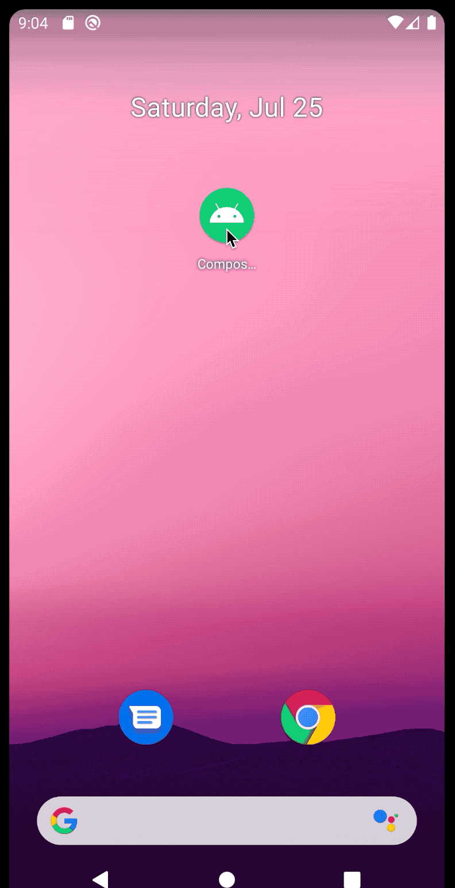

## ComposeFillableLoaders

|||
|---|---|

This is a port of my old library [AndroidFillableLoaders](https://github.com/JorgeCastilloPrz/AndroidFillableLoaders), which was an old port from [the iOS FillableLoaders](https://github.com/polqf/FillableLoaders) library by [Pol Quintana](https://github.com/polqf). The project uses [Jetpack Compose dev15](https://developer.android.com/jetpack/androidx/releases/compose).

The rationale of this project was to explore the `Canvas`, `Path`, and other related apis to write a frame based animation that relies on [`withFrameMillis`](https://developer.android.com/reference/kotlin/androidx/compose/dispatch/package-summary#withFrameMillis(kotlin.Function1)) to suspend and wait for each new frame to re-evaluate elapsed animation time and perform a new drawing based on it.

### Customization

To provide your own clipping transform you can use a function [like this one](https://github.com/JorgeCastilloPrz/ComposeFillableLoaders/blob/c388fa1e46c8559eda4f020618a947510b4919b0/app/src/main/java/dev/jorgecastillo/watercat/PlainClippingTransform.kt#L8) with your own clipping implementation.